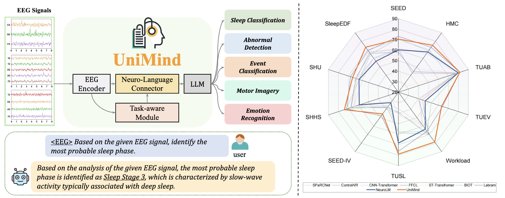

# UniMind




## Supported Datasets

| Dataset | Task | Channels | Sample Rate | Classes |
|---|---|---|---|---|
| SEED | Emotion recognition | 62 | 200 Hz | positive / negative / neutral |
| SEED-IV | Emotion recognition | 62 | 200 Hz | neutral / sad / fear / happy |
| HMC | Sleep staging | 4 | 256 Hz | W / N1 / N2 / N3 / R |
| SleepEDF | Sleep staging | 2 | 100 Hz | W / N1 / N2 / N3 / R |
| SHHS | Sleep staging | 1 | 125 Hz | W / N1 / N2 / N3 / R |
| TUAB | Abnormal EEG detection | 23 | 250 Hz | normal / abnormal |
| TUEV | Event classification | 23 | 250 Hz | 6 types |
| TUSL | Slowing classification | 23 | 250 Hz | bckg / seiz / slow |
| SHU | Motor imagery | 32 | 250 Hz | left hand / right hand |
| Workload | Cognitive workload | 19 | 200 Hz | high / low |

## Installation

```bash
conda create -n unimind python=3.9 -y
conda activate unimind
pip install torch==2.0.1+cu118 torchvision==0.15.2+cu118 --index-url https://download.pytorch.org/whl/cu118
pip install -r InternVL-EEG/requirements.txt
pip install flash-attn==2.3.6 --no-build-isolation
```

See [docs/installation.md](docs/installation.md) for full setup instructions.

## Quick Start

### 1. Prepare data

See [docs/data_preparation.md](docs/data_preparation.md) for how to convert raw EEG recordings into the required `.pkl` + `.jsonl` format.

### 2. Configure paths

Edit `InternVL-EEG/internvl_chat/shell/data/train_datasets.json` and `test_datasets.json` — fill in the `annotation` / `train` / `test` fields with your local `.jsonl` paths, and update `ch_names`, `mean`, `std` for each dataset.

### 3. Train

```bash
cd InternVL-EEG/internvl_chat
MODEL_PATH=pretrained/InternVL2-8B bash shell/train/train.sh
```

### 4. Evaluate

```bash
GPUS=1 bash shell/evaluate/evaluate.sh /path/to/checkpoint SEED
# Available datasets: SEED HMC Workload TUAB TUEV TUSL SEEDIV SHU SleepEDF SHHS
```

## Pretrained Weights

**InternVL2** (LLM backbone) — place under `InternVL-EEG/pretrained/`:
```bash
git clone https://huggingface.co/OpenGVLab/InternVL2-8B InternVL-EEG/pretrained/InternVL2-8B
```

**LaBraM** (EEG encoder) — download from the [LaBraM repository](https://github.com/935963004/LaBraM) and set the path via `--finetune` in `labram_encoder_fin.py`.

## Data Format

Each `.pkl` file stores one EEG segment:
```python
{"X": np.ndarray}   # shape [C, T], dtype float32
```

Each `.jsonl` line is one sample:
```json
{
  "id": "000000",
  "label": 0,
  "EEG": "path/to/sample.pkl",
  "conversations": [
    {"from": "human", "value": "<EEG>\nWhat emotion does this EEG signal represent? [positive, negative, neutral]"},
    {"from": "gpt",   "value": "positive"}
  ]
}
```

## Documentation

- [docs/installation.md](docs/installation.md) — environment setup and dependency installation
- [docs/data_preparation.md](docs/data_preparation.md) — raw EEG preprocessing and JSONL generation
- [docs/development.md](docs/development.md) — architecture details, training configs, development notes

## Citation

```bibtex
@article{lu2025unimind,
  title   = {UniMind: Unleashing the Power of LLMs for Unified Multi-Task Brain Decoding},
  author  = {Lu, Weiheng and Song, Chunfeng and Wu, Jiamin and Zhu, Pengyu and Zhou, Yuchen and Mai, Weijian and Zheng, Qihao and Ouyang, Wanli},
  journal = {arXiv preprint arXiv:2506.18962},
  year    = {2025},
  url     = {https://arxiv.org/abs/2506.18962}
}
```

## License

This project inherits the MIT License from InternVL. See [InternVL-EEG/LICENSE](InternVL-EEG/LICENSE) for details.
